# quarkus프로젝트시작! (학번:20250596 이름:김승윤 )

## 2, 3주차수업내용
실습1 : 쿼크스 환경구축 및 준비 - VS Code 설치 및 Quarkus Tools 확장하는 Quarkus 개발 환경 구축을 하였다. Quarkus 프로젝트 실행하기 위해 하단 터미널에 직접 ./mvnw quarkus:dev을 입력하여 시작한다. 

실습2 : HTML 기본 및 LOL 메인화면 개발 - http://localhost:8080/주소로 접속하며 일부 코드를 수정하며 작성하며 HTML 기본과 LOL 메인화면 페이지 만들기를 하였다. LOL 테마를 커스텀하고 반응형 그리드를 변경하는 실습을 해보았다. 

<소감>: 환경을 구축하는것도 너무 힘들었지만 프로그램과 실제 웹페이지를 켜서 프로그램에서 내가 적는 코드가 웹페이지에 어떤 영향을 끼치는지 내 눈으로 직접 확인하며 내 손으로 페이지를 만드는 것이 재밌었고 앞으로 더 무엇을 배울지 기대된다.

 

## 4주차수업내용
실습1: 하이퍼 링크 - lol 메뉴에 링크 추가하기 위해 공식웹사이트 메뉴 및 링크를 만든다.                 
                <ul class="navbar-nav ms-auto">
                    <li class="nav-item"><a class="nav-link" href="https://lol.ps/"target="_blank">외부웹사이트</a></li>
                </ul>
이 코드를 통해 메뉴에서 외부웹사이트를 클릭하면 공식웹사이트로 이동하게 된다.

실습2: 이미지 -  현재 메인 화면 이미지는  라는 코드로 되어있고 "" 안에 사진 이름을 넣으면 된다. 먼저 Resources 폴더 안에 images 폴더 생성한다. 그리고 다운받은 이미지를 이동하여 파일의 경로와 이름을 직접 지정하고 저장을 하고 난 후, 새로고침을 하면 기존 사진에서 내가 고른 사진으로 변한 것을 볼 수 있다.

실습3:  네비게이션 바 수정하기 -  기본 메뉴를 수정하고 디자인 배경이 흰색으로 되어 있어서 배경과 색이 살짝 다른 어두운 검정색으로 수정했다. 그리고 드랍다운메뉴인 외부사이트를 눌러 롤전적을 클릭하면 공식웹사이트로 가는 주소 링크도 추가했다.

실습4: 챔피언 카드 추가하기(그리드, 세부정보) - 현재 그리드는 row g-4인데 이것을 주석하고 열의 너비를 자동 지정하는 
로 변경하면 카드가 넓어진 것을 볼 수 있다. 그리고 세부 정보를 넣기 위해 챔피온(Aatrox)의 기본 정보 수정하기 위해 기존 코드는 주석 처리를 한고 새로운 코드를 작성 후 저장한다. 이후 화면을 확인하면 Aatrox만 커진 것을 볼 수 있었다.

실습5: 모달창 구현 - 챔피온 세부 정보 출력하기 위해 모달창을 구현한다. 내부 페이지는 Aatrox.html를삽입 했고 기본 헤더, 바디, 푸터로 구성되어 있다. 저장 이후 화면을 확인하면 Aatrox 아래에 세부 정보와 상세 보기가 생겼다. 상세파일을 클릭해보면 아직 파일이 없다.

<소감>: 우리가 일상생활에서 자주 사용하는 웹 페이지가 이렇게 복잡한줄 몰랐다. 상단바가 네비게이션 바라고 부르는것도 처음 알았고 이 색은 배경에 따라 자동으로 색이 변하는 줄 알았는데 제작할때 색깔을 정해서 만든 것을 처음 알았다. 그리고 캐릭터들의 카드들을 row 영역 안에 배치하여 화면 비율 크기에 따라 배열하는 방법이 달라지게 하는 것도 신기했고 각 캐릭터의 이미지도 내 마음대로 바꾸는 방법도 알게 되어 기뻤다. 나중에 나만의 페이지를 만들때 정말 많은 도움이 될 것 같다.

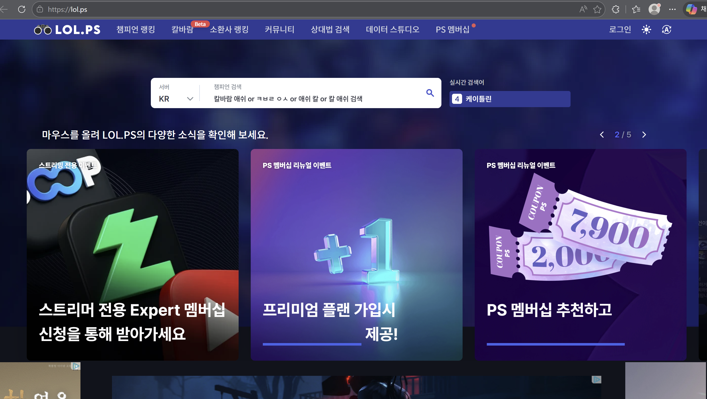
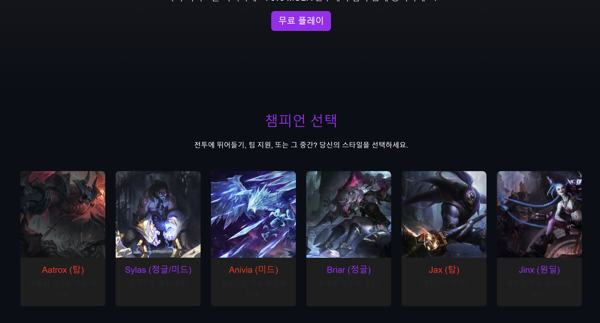

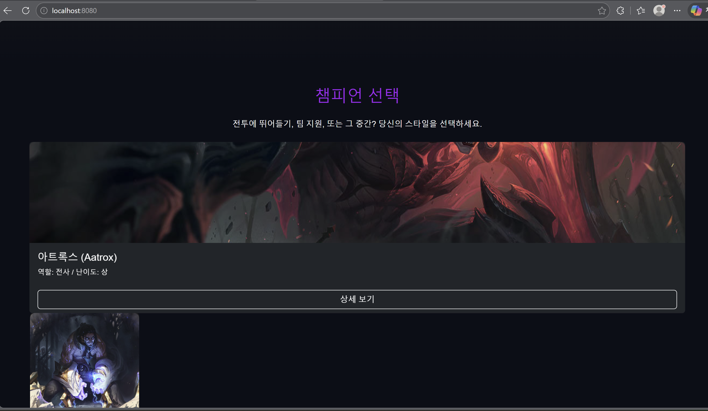
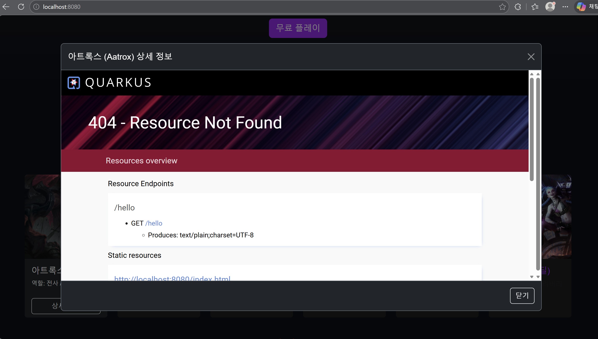

 

## 5주차수업내용
실습1: 모달창 구현하기2 -  폴더 생성 및 코드 수정하여 resources 폴더에 modals 폴더 생성한다. 그리고 그 폴더에 Aatrox.html을 저장한다. HTML 파일의 위치가 변경되면 리소스(이미지)의 상대경로 기준이 달라지기 때문에 상위 폴더로 이동하기 위해 ../를 사용해야한다.저장하고 새로고침하면 화면에 Aatrox의 상세 정보와 이미지가 뜨는 것을 볼 수 있다.

실습2: 서브 페이지 추가하기 - Download.html을 직접 수정해서 index.html의 코드를 전체 복사, 붙여넣기를 한다. 네비게이션 코드 아래는 모두 지우고 저장한다. 다시 화면으로 돌아가서 다운로드 링크 클릭하면 화면을 확인하면 비어 있다.

실습3: 서브 페이지 구현하기2 - LOL 공식 웹의 다운로드 화면 구성해본다. 상단 다운로드 배경, 클릭하면 다운로드 파일 링크, 권장 시스템 사양, 윈도우/MAC 구분 버튼, 권장 시스템 세부 사양(표) 등을 구현하도록 한다. download.html을 추가 수정한다. 최하단 시스템 사양 테이블(표) 추가하기 download_table.html 열어서 hero 영역 아래 코드 전체를 추가한다.
<tr>은 행, <td>는 내부 셀(cell), 헤더, 본문, 하단 구분(하단은 잘 사용하지 않는다.)
저장 후 화면을 확인해보면 반응형 표이다.

<과제1> - 추가 구현하기: 네비바 안에 LOL 로고 삽입해본다. 먼저 왼쪽 위에 LOL 로고가 보이도록 이미지 태그를 추가했다. 기존에 있던 Navbar 글자도 그대로 보이게 하기 위해 로고 옆에 텍스트를 함께 배치했고 로고 이미지가 너무 크게 표시되지 않도록 CSS에서 크기를 조절했다. 마지막으로 메뉴들이 네비게이션 바 가운데에 위치하도록 ul 태그의 정렬 속성을 수정하였다.

<과제2> - 추가 구현하기2: 2025년 이후 출시된 신규 챔피온인 멜, 유나라, 자헨을 추가하여 보고 상세 정보 모달 추가 구현해본다. 추가한 챔피언은 멜, 유나라, 자헨이며, 기존 챔피언 카드와 같은 형식으로 이름, 역할, 난이도를 표시했다. 또한 각 카드에 상세 보기 버튼을 추가하여 버튼을 클릭하면 챔피언 상세 정보 모달이 열리도록 구현하였다. 새로 추가한 카드들도 기존 카드들과 같은 row 영역 안에 배치하여 화면 크기에 따라 자동으로 정렬되도록 수정하였다.

<소감 및 문제해결>: 저번 수업때 모달창을 제대로 구현하지 못하고 끝났었는데 이번에 상위 폴더로 이동하기 위해 ../으로 모달창을 제대로 구현된 것이 신기했다. 그리고 과제를 처음 봤을때 혼자서 할 수 있을까 걱정됐는데 수업시간에 했던 것들을 참고하면서 천천히 따라해보니 수업때 했던것 처럼 잘 구현된 것을 보고 뿌듯해졌다. 처음에 로고 크기를 조절하지 못해서 당황했지만  가운데에 위치하도록 다시 수정해서 잘 구현되었고 카드들은 기존 카드들을 참고해서 구현했다.

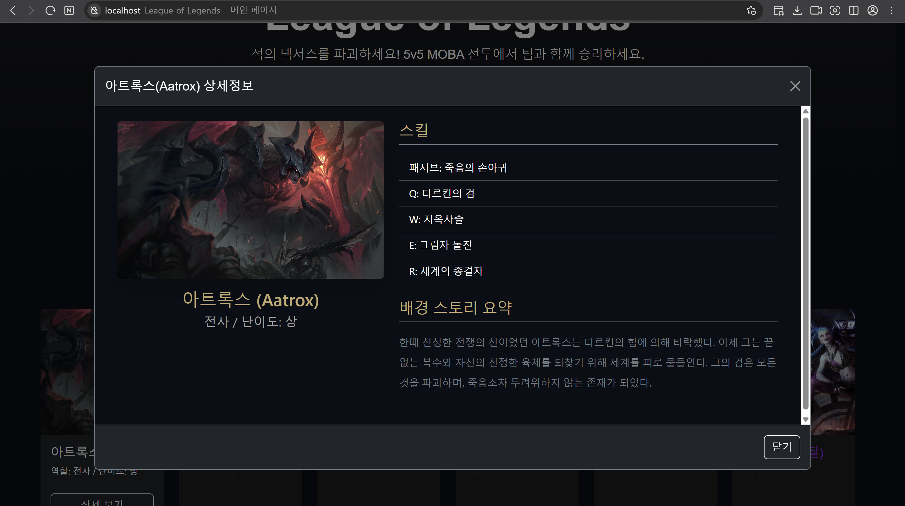

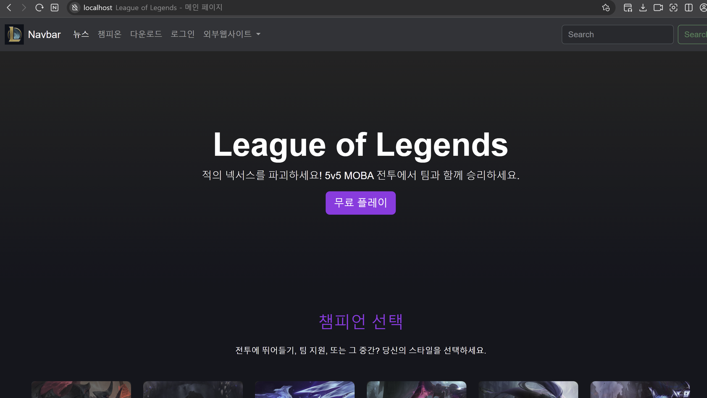
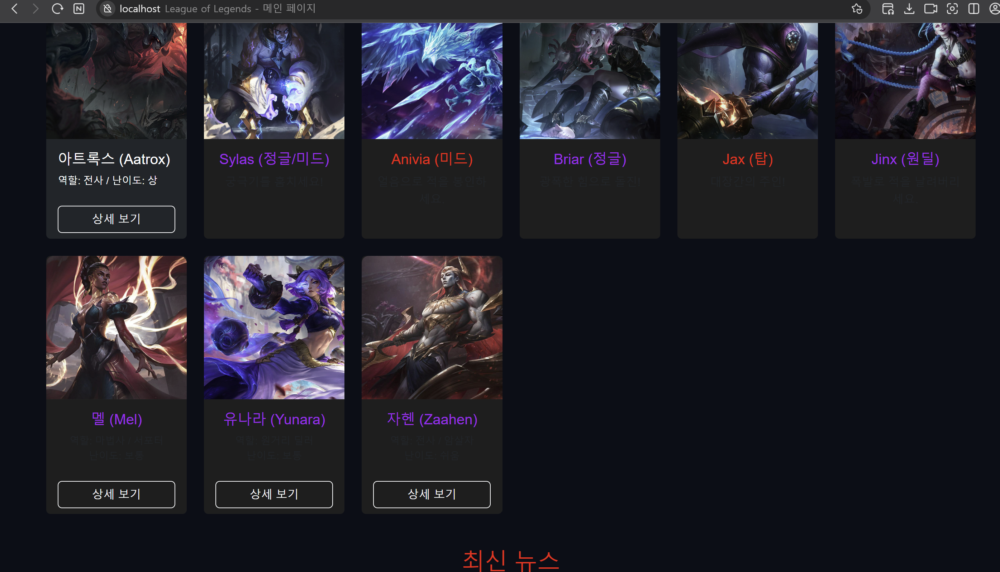

 

## 6주차수업내용
실습1: 자바스크립트 활용하기 -  JS 폴더를 생성하고 파일 복사한다. js에 다운받은 부트5(.js) 라이브러리를 복사하여 내부 로컬에서 연동한다. Html 파일 내에서 직접 js삽입(head)한다.
    
    를 넣어 페이지 새로고치면 "메인 페이지 로딩 완료"라는 팝업 창이 뜨게 된다. 왜냐하면 window.onload가 윈도우를 열(로드)때마다 뜨게 하는 것이기 때문이다.

실습2:  자바스크립트 활용하기 - "무료 플레이를 클릭하면 즐거운 플레이 되세요"라는 화면이 작게 뜨게 된다. 아까와 다른 이유는 이번 코드는 버튼을 클릭하였을때 뜨기로 되어 있기 때문이다. 그래서 새로고침을 한다고 했을때 뜨지 않고 무료 플레이 버튼을 눌러야 뜨는 것이다.

실습3: 자바스크립트 기본 문법1 - 블록 스코프 내에서만 접근이 가능한 if문이다. 첫번째 줄은 접근 가능하고 두번째 줄은 접근이 불가능하다. 세번째 줄은 에러가 나지 않는데 두번째 줄을 주석처리하고 페이지를 다시 로딩한다면 세번째줄도 에러가 나는 것을 볼 수 있다. 이렇게 두번째 줄을 주석을 해야 세번째줄이 에러가 나는 이유는 인터프리터 언어는 한줄씩 실행이 되기 때문이다. 즉, 두번째 줄에서 에러가 났기 때문에 멈춰서 세번째 줄은 실행되지 않은 것이다.

실습4: 자바스크립트 기본 문법2 - var은 고전적인 방식이다. 코드를 봤는데 똑같은 변수를 선언하고 값을 변경했는데 가능한 방법이다. let과 const는 되지 않는다. 호이스팅이라고 하는 것은 코드 실행전, 선언부를 해당 스코프 상단으로 끌어올린다.

실습5: LOL 기능 구현 중 실시간 챔피언 검색하기 - 검색창을 만들어뒀지만 아무런 반응이 없기 때문에 기능을 추가해야한다. 텍스트창 같은 것이 있는 것을 form창이라고 부른다. 이를 자바스크립트를 이용해 버튼을 누르면 실행이 되도록 본다. search를 searchForm으로 바꿔주고 id가 고유값이다. 그리고 search.js 파일을 만들어서 html 최하단에 연동한다. 그러고 페이지에서 검색을 해보면 오류가 난다. 다시 indev=x.html.dp 하단으로 가서  를 해주면 오류가 나지 않는다. 내가 클릭을 하는 순간 타입 중 submit이 실행이 되는 것이다.

<소감 및 문제해결>: 우리가 사용하는 웹사이트에서 팝업이 뜨는 경우를 자주 보았는데 그 팝업창을 구현해보니 신기했다. 그리고 자바스크립트의 문법이 복잡하고 시대에 따라 많은 변화가 있는 것을 알게 되었다. 그리고 우리가 구현한 것(보통 .js파일)을 제대로 불러오기 위해 index.html에 연결을 해줘야할 것을 주의하게 되었다.

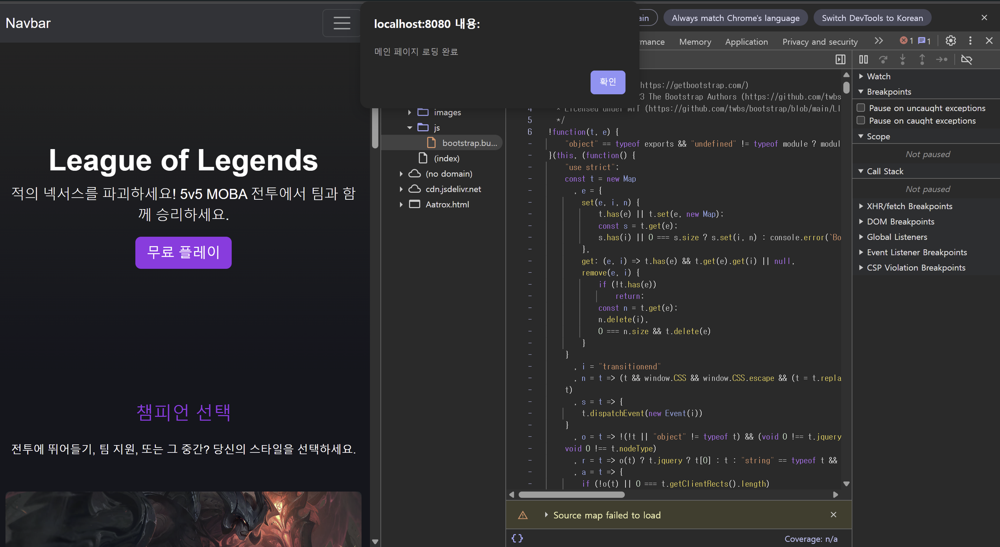
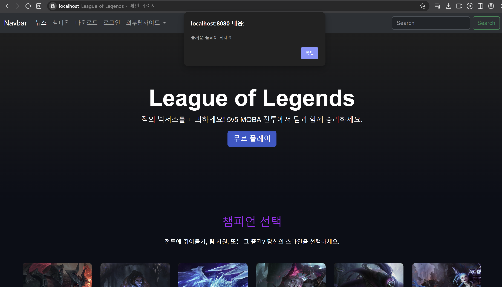

 

## 7주차수업내용
실습1: 실시간 챔피언 검색하기1 - Js 파일인 search.js 파일을 작성하고 html 최하단에 연동한다. DOM(Document Object Model)이라는 것을 추가하였는데 이것이 필요한 이유는 HTML 로딩을 위한 표준 구조와 트리 구조(DOM)로 변환하여 관리하는 역할을 하기 때문이다. 이것은 새로운 창을 열면서 검색 결과 출력한다. 입력: 이벤트, 검색 : 이벤트이고 F12 개발자 모드로 소스를 확인할 수 있다.

실습2: 실시간 챔피언 검색하기2 - 해당 코드를 뉴스 섹션 하단에 붙여넣기를 해준다. 하지만 아직 동작하지 않는 것을 볼 수 있다. 왜냐하면 검색을 해야 보여지게 되어있기 때문이다.
구현시키기 위해  search.js에 기존에 있던 코드는 주석처리 해주고 새로운 코드를 넣어준다. 문자열 앞에 이름이 들어가 있는 것을 볼 수 있는데 이것은 객체배열로 키와 값으로 되어 있어서 키로 검색읋 하면 빠르게 찾을 수 있다.

실습3: 아트록스 검색하면 아래에 있는 화면이 출력되는 것을 볼 수 있다. 기본 동작(코드)를 이해해 보자면, 현재 폼의 id는 searchForm(동일)이고 핵심 함수는 performSearch이다. 데이터 셋으로 부터 filter 조건 충족하고 키워드 가운데 출력해주는 것은 searchKeywordDisplay이다. 필터 결과 카운팅(숫자)는 0개인 경우 화면을 처리한다. 탭(기본) 전환은 switchCategory이고 카테고리 클릭(빨간 왼쪽 테두리)은 Type으로 판단한다.

<과제1> - 데이터정의 추가하기: 저번 과제에서 추가한 멜, 유나라, 자헨 카드에 이름, 역할, 난이도를 표시하고, 상세 보기 버튼을 누르면 Bootstrap 모달창을 통해 챔피언 상세 정보가 보이도록 구현하였다. 또한 search.js의 CHAMPIONS 배열에 신규 챔피언 데이터를 추가하여 검색창에 한글 이름 또는 영어 이름을 입력하면 해당 챔피언이 검색 결과 화면에 뜨도록 구현하였다. 

<과제2> - 검색어기능 추가하기: 검색 결과 화면이 표시된 상태에서 검색창을 공백으로 두고 Search 버튼을 클릭하면 showMainScreen() 함수가 실행되도록 구현하였다. 이 함수는 검색 결과 영역을 숨기고, 기존 메인 화면의 section들을 다시 표시한다. 빈 검색어 입력 시 검색 결과 화면에서 메인 화면으로 정상적으로 되돌아간다. 즉, 검색어가 없거나 공백인 경우에는 showMainScreen() 함수가 실행되어 검색 결과 화면을 숨기고 기존 메인 화면으로 돌아간다.

<소감 및 문제해결>: 수업 시간에 아트록스의 이름을 검색해도 화면이 넘어가지 않아서 오류를 해결하느라 애먹었다. 그래도 수업이 다 끝난 후에 혼자 천천히 코드를 살펴보니 내가 상단과 하단에 같은 코드를 입력하여 꼬인 것을 알게 되고 화면이 정상적으로 뜰 수 있게 되었다. 이렇게 스스로 오류를 수정하며 해결해보니 실력이 조금이라도 성장한 기분이 들었다.

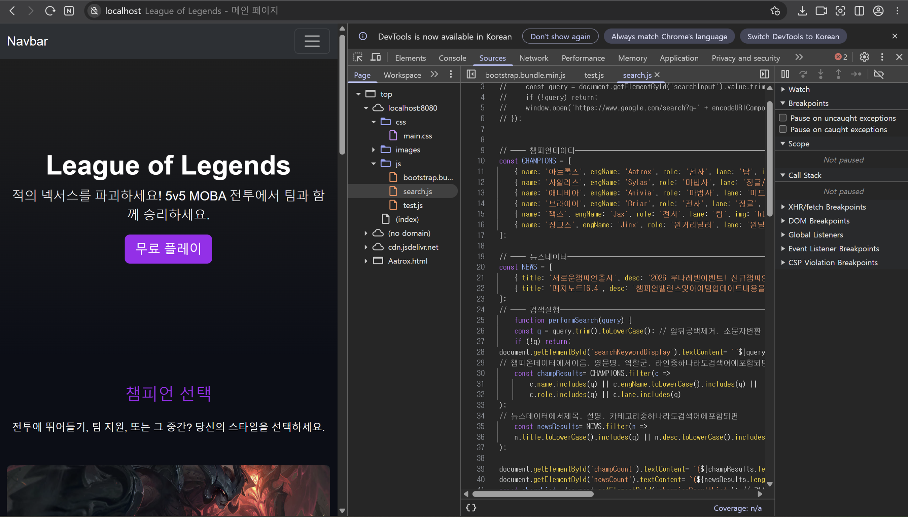
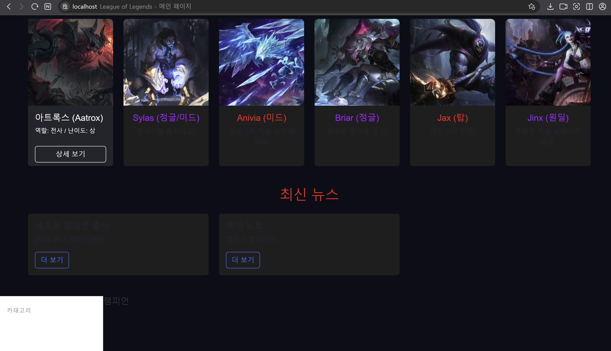
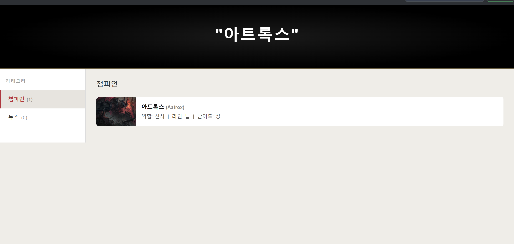
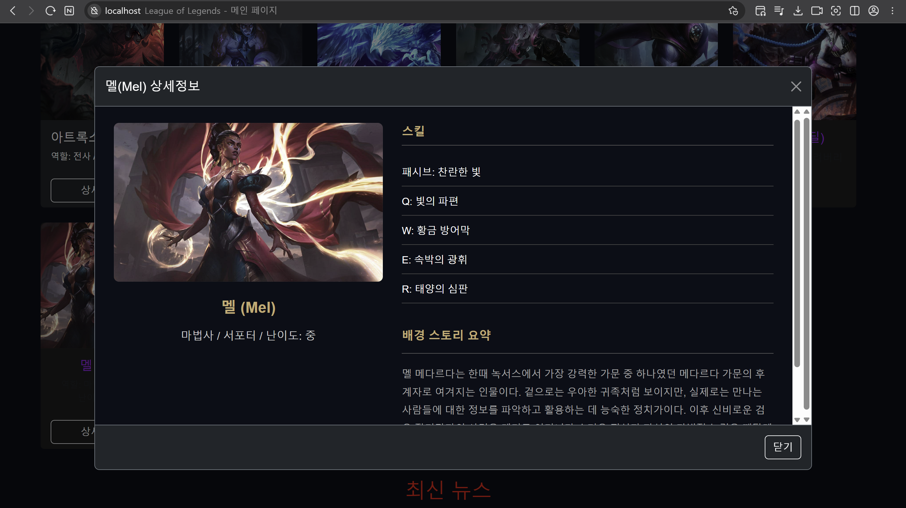
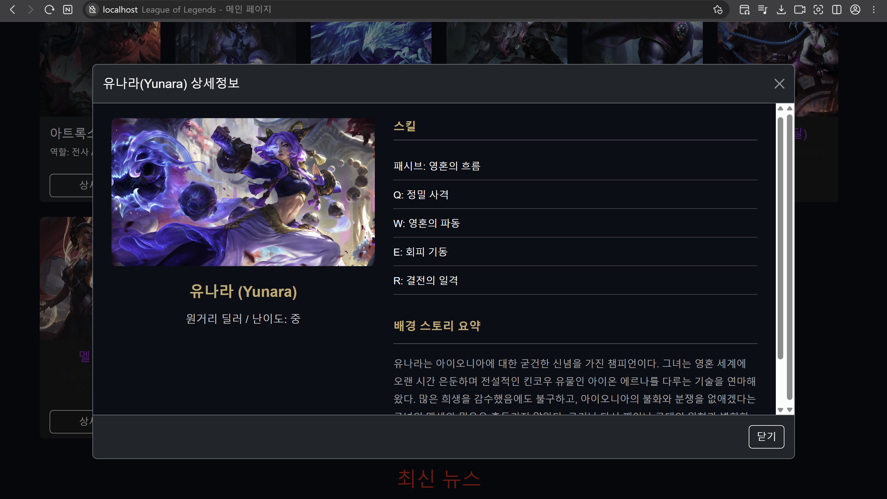
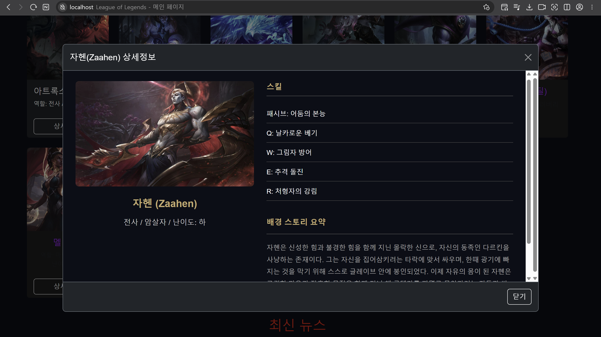
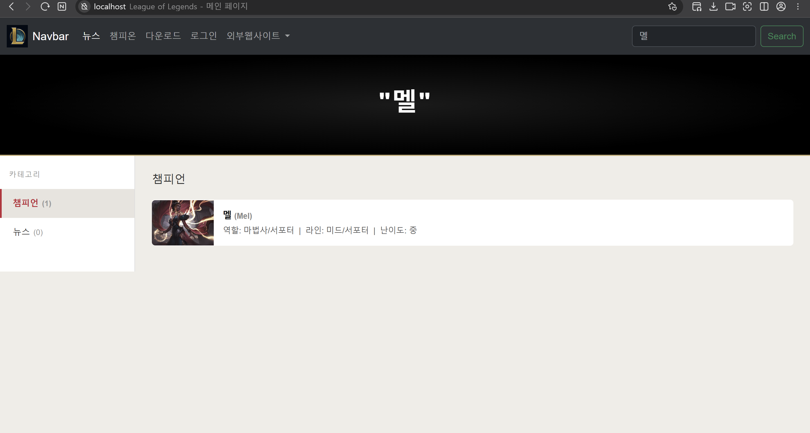
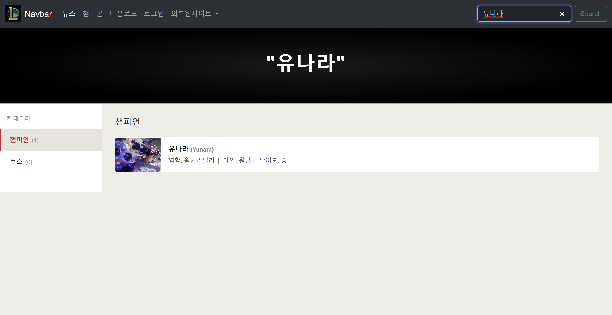
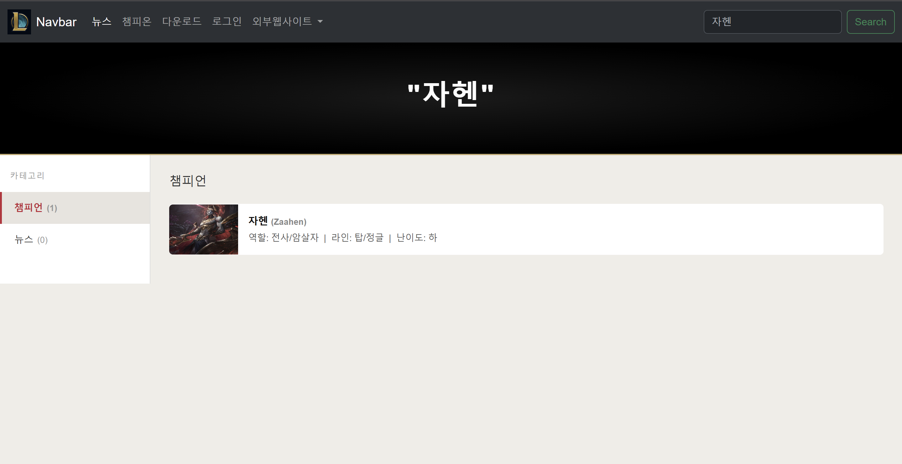
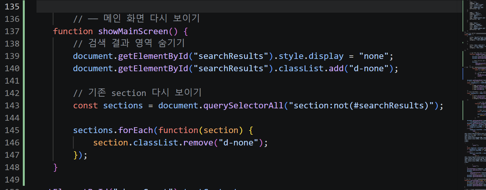

 

## 9주차수업내용
실습1: 다크모드 / 라이트 모드 전환 - toggle/js라는 파일을 만들어서 피피티에 있는 코드를 넣어주고 index.html에 방금 만들어준 toggle.js를 연결해준다. togggle.js에 추가한 코드는 기본에 있었던 다크 모드를 지워주고 필요한 속성들로 교체해주거나 콘텐츠가 라이트가 아니라 다크라면 기존에 있던 라이트 모드를 지워주고 다크 속성으로 교체해주는 일을 한다.

실습2: 데이터베이스 연동 - MySQL 데이터베이스를 프로젝트와 연동하는 과정을 진행하였다. 비밀번호를 설정했고 시작은 mysql을 입력하고 현재 데이터베이스 확인하고 싶으면 show databases; 라고 친다. 새로운 db생성(LOL 웹 서버 전용)하고 싶으면 create database lol;를 치고 MYSQL 내부, db 사용 및 테이블 보고 싶으면 use mysql;를 친 후 show tables;를 치면 된다. 마지막으로 최하단 user 테이블(구조 및 정보 조회)를 원한다면 desc user; 후에 select * from user; (root 계정 확인)을 치면 아래와 같은 화면을 볼 수 있다. 그리고 항상 명령어 마무리는 ;이므로 주의한다.

실습3: 데이터베이스 연동 (프로젝트 dev 보드를 통한 확인) - Quarkus의 Dev UI를 통해 데이터베이스 연동 상태를 확인하였다. 서버 실행 후 http://localhost:8080/q/dev/에 접속하여 DB connection pool과 MySQL 연결 정보를 확인하였고, champion 테이블이 생성되었는지 확인한 후 http://localhost:8080/champions 경로에서 챔피언 데이터가 JSON 형식으로 출력되는 것을 확인하여 데이터베이스와 웹 서버가 정상적으로 연동된 것을 아래 화면처럼 확인할 수 있었다.

<과제1> - 챔피온 검색 결과 모달창 띄우기: 검색 결과 화면에서도 챔피언 상세 정보를 확인할 수 있도록 하기 위해 search.js의 CHAMPIONS 배열에 modalId 속성을 추가하였다. modalId에는 index.html에 작성된 각 챔피언 모달의 id 값을 저장하여, 검색 결과 카드와 기존 모달창이 연결되도록 하였고 검색 결과 카드 HTML에 상세 보기 버튼을 추가하고, Bootstrap의 data-bs-toggle="modal"과 data-bs-target 속성을 사용하였다. data-bs-target 값에는 각 챔피언 데이터의 modalId를 적용하여, 검색된 챔피언에 맞는 상세 모달창이 열리도록 구현하였다. 결과적으로 사용자가 검색창에 챔피언 이름을 입력하면 검색 결과가 출력되고, 검색 결과의 상세 보기 버튼을 클릭하면 메인 화면의 챔피언 카드와 동일한 방식으로 상세 정보 모달창을 확인할 수 있다.

<과제2> - 모든 페이지에 동일 적용하기: 다크/라이트 모드 전환 기능의 JavaScript 호출 방식을 기존에는 HTML 버튼 내부에서 onclick="toggleTheme()" 방식으로 함수를 직접 호출했지만 이를 제거하고 이벤트 리스너 방식으로 변경하였다. toggleTheme() 함수는 body에 light-mode 클래스를 추가하거나 제거하여 테마를 변경하는 역할을 한다. theme-toggle-btn 클래스를 추가하고 toggle.js에서 addEventListener("click", toggleTheme)를 사용하여 버튼을 클릭하면 toggleTheme() 함수가 실행되도록 구현하였다. toggleTheme() 함수는 body에 light-mode 클래스를 추가하거나 제거하여 화면의 다크/라이트 모드가 전환되도록 하였다. 마지막으로 메인 페이지처럼 다운로드 페이지도 동일한 토글 버튼과 toggle.js 파일을 적용하여 두 페이지 모두에서 다크/라이트 모드 전환이 가능하도록 구현하였다.

<소감 및 문제해결>: 처음에는 HTML, CSS, JavaScript 각각의 역할이 헷갈렸지만 검색 기능, 모달창, 다크/라이트 모드 전환을 직접 수정해보니 각 파일이 어떤 역할을 하는지 좀더 명확하게 알게 되었다. 데이터베이스 연동 실습에서는 Champion.java, ChampionResource.java, DataSeeder.java의 역할을 구분하고 자바 객체가 데이터베이스 테이블과 연결되고 API를 통해 JSON 형태로 출력되는 흐름이 신기했다. 
이번 과제를 통해 데이터를 저장하고 불러오는 웹 애플리케이션의 전체 구조를 경험하게 되어 흥미롭고 재밌었다. 그리고 그동안 페이지가 넘어가면 몇몇 페이지의 네비게이션바 비율이 조금씩 달랐는데 main.css와 download.css에 같은 버튼 스타일을 적용하여 두 페이지의 네비게이션 바, 토글 버튼 크기, 글자 크기가 동일하게 보이도록 수정했다. 

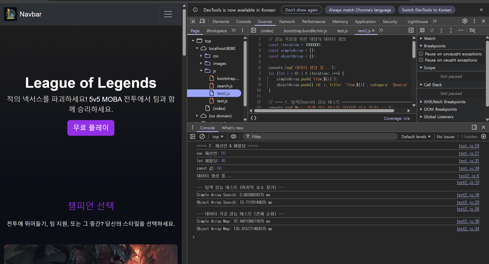
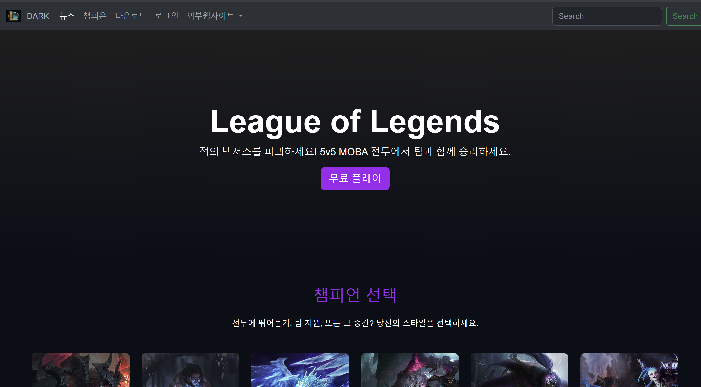
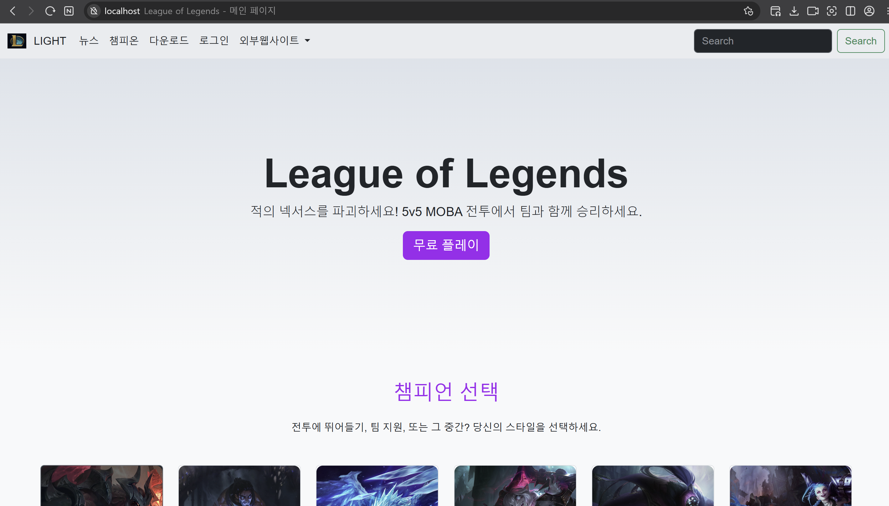
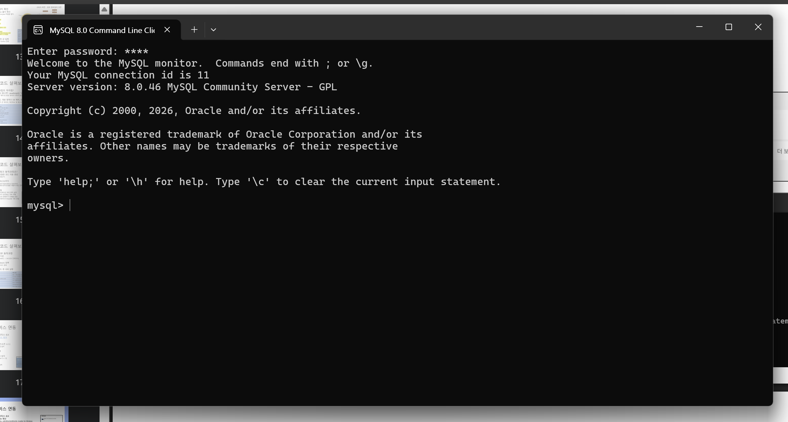
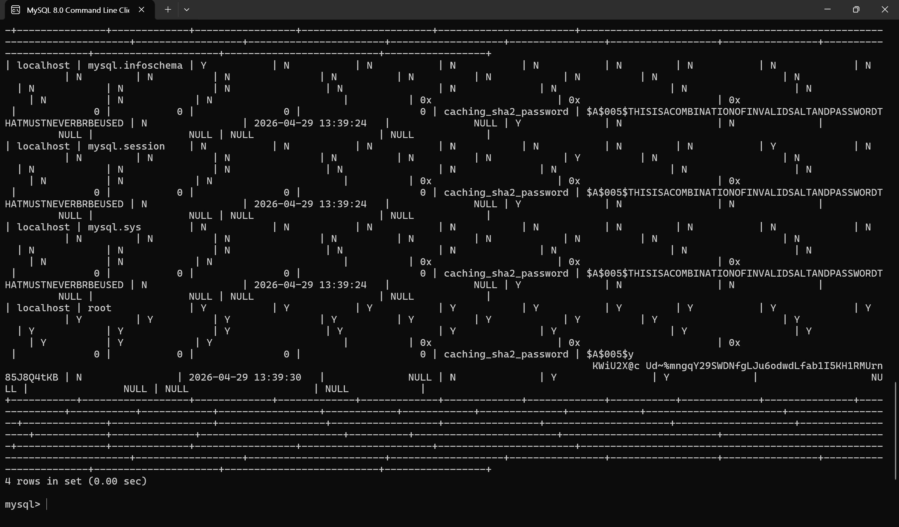
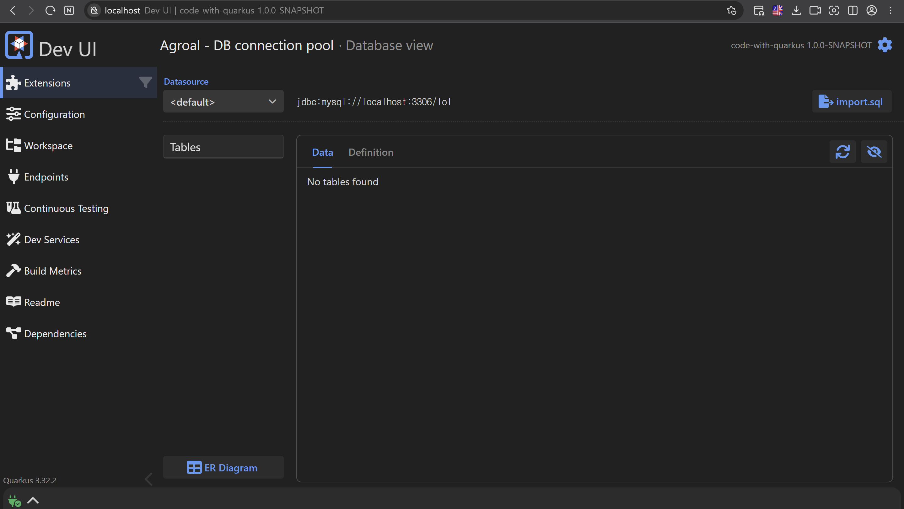
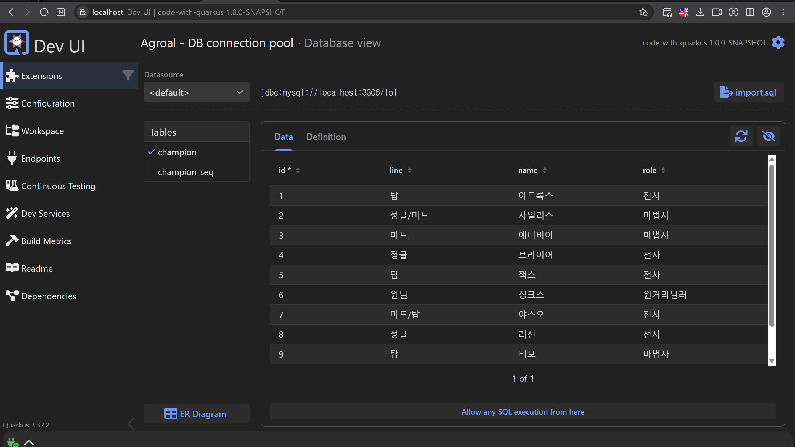
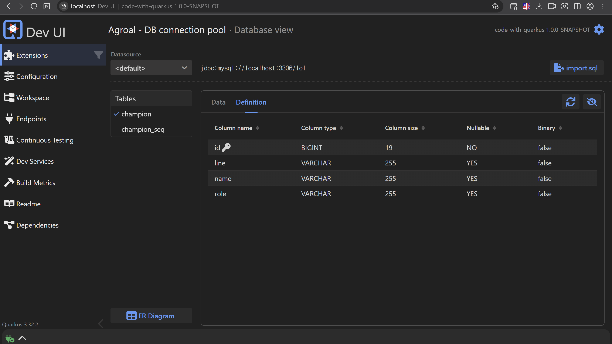
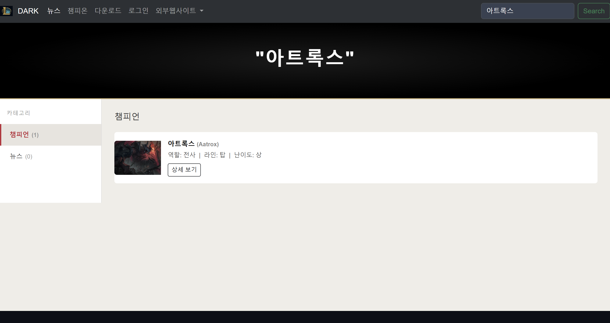
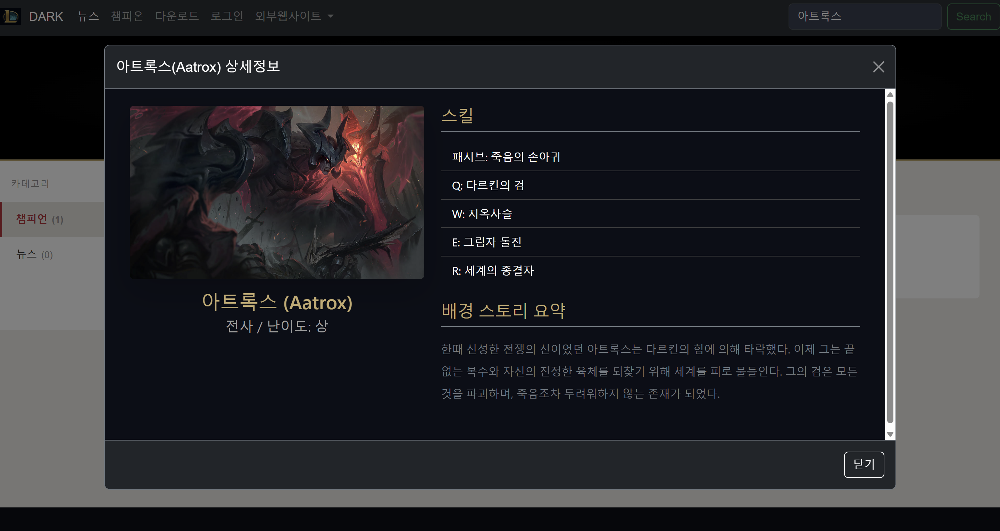
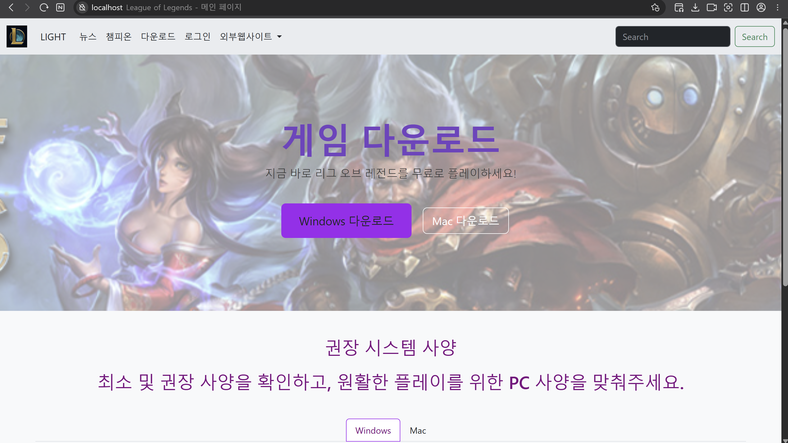
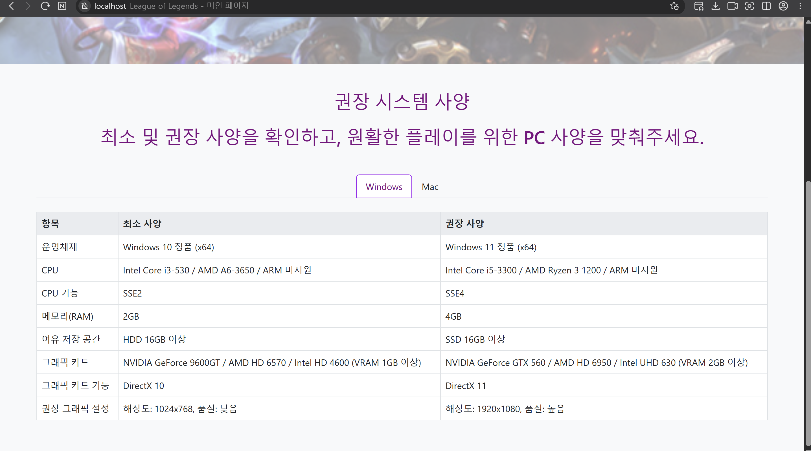

 

## 10주차수업내용
실습1: 메인화면 로그인 버튼 연결하기 - 기존에 있던 로그인부분을 보면 href가 비어있는 것을 볼 수 있다. 해당 코드를 지우고 피피티에 있는 코드로 바꿔준다. 기존에 있던 코드와 또 다른 점이 있는데 일반은 파일로 저장하고 로그인은 쿼커스 프레이머를 통해서 꼭 이동해야한다. 즉 로그인은 슬러시 로그인은 벡앤드를 활용해야한다. 하지만 로그인에 대한 경로가 없어서 오류가 난다. 그리고 이어서 다음 코드를 넣으면 화면만 넘어가는 경로만 구현했고 아이디와 비밀번호 화면은 구현하지 않았다. 

실습2: 로그인 페이지 작성하기 - 피피티에 있는 코드를 넣고 저장 뒤에 화면을 재시작하게 되면 아래와 같은 아이디와 비밀번호를 쳐서 들어갈 수 있는 화면으로 된것을 볼 수 있다.

실습3: Quarkus/login_check 엔드포인트 구현하기 - AuthResource 하단에 해당 코드를 넣어주고 login 폴더에 main_after_login.html를 추가한다. 그리고 기존  index.html을 다시 쓰지만 로그인 부분을 로그아웃으로 바꿔준다. 후에 로그인 화면에서 아무 아이디와 비밀번호를 치면 아래처럼 화면이 구현된 것을 볼 수 있다. 하지만 지금은 로그인을 했는지 확인하는 코드가 없어서 로그아웃 화면 링크로 들어가면 로그인을 하지 않아도 들어가지는 오류가 있는 것을 볼 수 있다. 그래서 User.java에 피피티에 있는 코드를 넣어준다. dev UI에도 구현된 것을 볼 수 있다.

실습4: 임시 사용자 데이터 삽입하기 - 이제 임시 사용자 데이터를 삽입하기 위하여 피피티에 있는 코드를 DataSeeder.java에 추가한다. 그러고 에러가 뜨는데 User 클래스 연동(import)하려고 눌러보면 quick fix가 뜨고 세번째 줄 org가 있는 것을 눌러주면 연동이 된다. 그러고 dev UI에 들어가면 아래처럼 구현된 것을 볼 수 있다. 우리가 사용한 방법은 Active Record이다. 뱅킹이나 카드사같이 사람들이 많이 쓰는 것은 이 방법으로 쓰이지 못하기 때문에 더 보안성이 좋고 많은 사람들이 이용할 수 있게 Data Mapper를 사용한다.

<과제> - 로그인 페이지의 다크/라이트 모드를 구현하기: 기존 로그인 페이지는 구버전 네비게이션 바를 사용하고 있어 메인 페이지와 디자인이 다르고, 다크/라이트 모드 버튼도 정상적으로 작동하지 않았다. 이를 해결하기 위해 기존 index.html에서 사용하던 네비게이션 바 구조와 main.css 스타일을 login.html에 재활용하였다.
toggle.js 파일을 로그인 페이지에도 연결시켜서 DARK/LIGHT 버튼을 클릭하면 body에 light-mode 클래스가 추가되거나 제거되어 그 결과 로그인 페이지에서도 메인 화면과 동일하게 다크 모드와 라이트 모드가 아래 사진과 같이 전환이 된다.

<소감 및 문제해결>: 나는 로그인 화면에서 로그인을 하게 되면 다시 메인화면으로 돌아가게 되는줄 알았는데 로그아웃 화면을 다시 만들어야한다는 것을 알게 되었다. 그리고 세션을 배울때 인터넷 뱅킹을 사용하다가 30분 정도 지나면 로그아웃 되는 것이 신경쓰였는데 이 기능이 세션이라는 것을 알게되었고 중요한 기능인 것을 알게되었다. 세션이 유지되어야 돈도 보내는 등 그런것을 할 수 있다는 것을 알게 되었고 세션 기능인것을 알게 되었다.
이번 과제에서도 로그인 페이지의 다크/라이트 모드를 적용시켜야하는데 몇몇 텍스트의 크기가 이상해지는 오류가 생겨서 수정하며 다시 코드를 제대로 공부해보며 고쳤다.

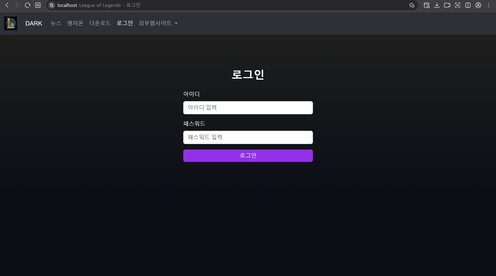
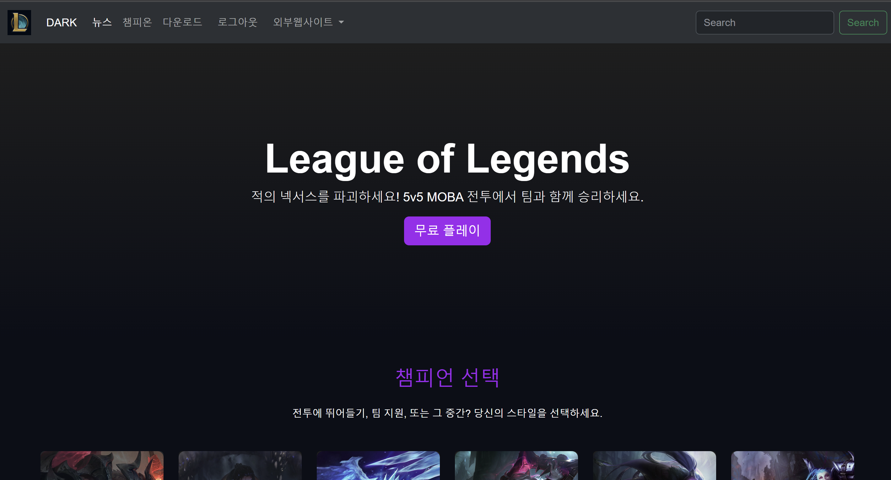
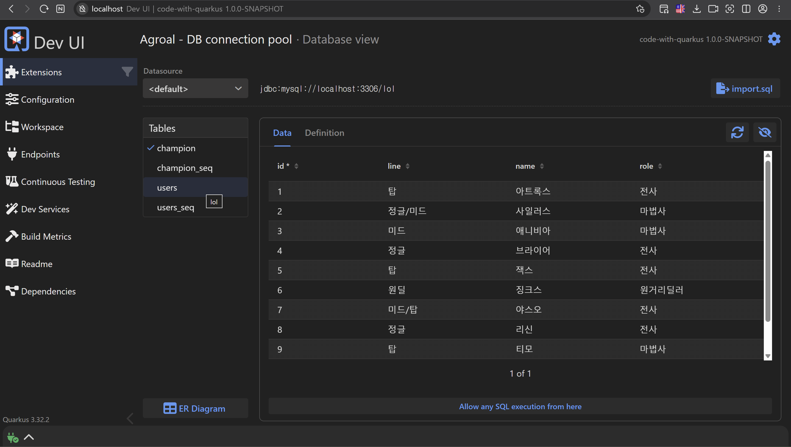  
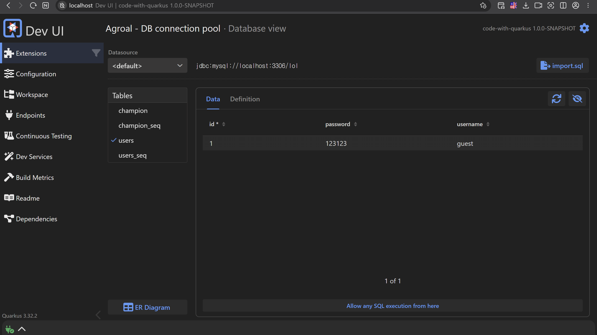  
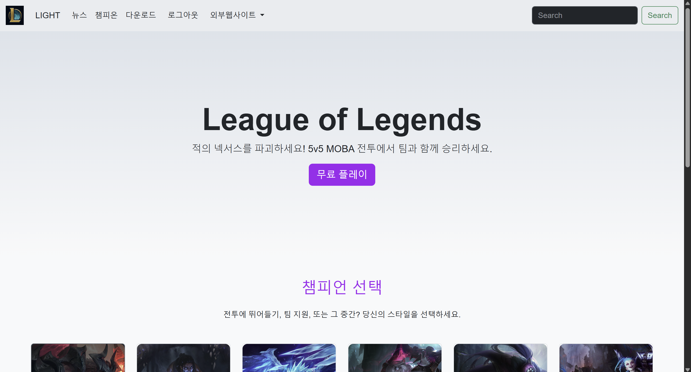

 

## 11주차수업내용
실습1:  세션 활성화 설정 추가와 DB 사용자 체크(login_check) 완성하기 - 로그인 후 사용자 상태를 유지하기 위한 세션 기능을 구현해본다. SessionConfig.java라는 파일을 새로 생성하여 세션 저장소와 세션 핸들러를 등록하고 세션 유지 시간 및 HttpOnly 쿠키 옵션을 설정하였다. 그리고 AuthResource.java에서 로그인 성공 시 사용자 정보를 세션에 저장하고 로그인 후 페이지 접근 시 세션 존재 여부를 확인하여 비로그인 사용자의 접근을 차단하도록 구현하였다. 
그래서 적어놓은 사용자 정보인 아이디: guest 비밀번호: 123123이 아니라면 로그인이 되지 않는다. 그리고 로그인 이후 개발자모드를 켜서 Application에 Cookies에 들어가 확인해 구현된 것을 볼 수 있다.

실습2: /logout 로그아웃 엔드포인트 구현하기 - 로그인 이후에 로그아웃을 누르게 되면 제대로 로그아웃이 되는 로그아웃 기능을 구현해본다. 로그아웃 요청 시 현재 세션의 ID와 로그인 사용자 정보를 콘솔에 출력한 뒤, context.session().destroy();를 사용하여 세션 데이터를 삭제된다. 이후 메인 페이지로 이동하게 설정하고, /after_login 재접근 시 로그인 페이지로 차단되는지 확인하여 로그아웃 동작을 검증할 수 있다.

실습3: 회원가입 화면 구현하기 - 회원가입 화면을 구현하고 로그인 페이지와 연결시켰다. login.html의 로그인 버튼 아래에 회원가입 버튼을 추가하여 /register 페이지로 이동하도록 하였고, AuthResource.java에 /register 엔드포인트를 작성하여 register.html이 출력되도록 하였다.
register.html은 기존 index.html의 네비게이션 바와 main.css를 재활용하여 전체 페이지 디자인을 통일하였다. 회원가입 폼에는 아이디, 패스워드, 패스워드 확인, 이메일, 연락처 입력칸을 구성했다. dev UI에도 구현된 것을 볼 수 있다.

실습4: 입력 값 유효성 검사 추가하기 - js 폴더에 input_check.js 파일을 생성하고 validateAndShowModal() 함수를 작성한다. 아이디는 4~20자 영문/숫자만 허용하고, 패스워드는 8자 이상이며 영문, 숫자, 특수문자를 포함하도록 정규식을 사용해 검사한다. 또 패스워드 확인 값이 일치하는지 확인하고, 이메일과 연락처 형식도 검사하도록 구현하였다.
입력값이 조건에 맞지 않으면 Bootstrap의 is-invalid 클래스와 invalid-feedback 영역을 사용하여 오류 메시지 아래와 같은 사진처럼 화면에 표시되도록 하였다. 즉 모든 입력값이 유효한 경우에만 registerForm이 서버로 전송된다.

실습5: 암호화 추가하기 - 회원가입 기능에 패스워드 암호화 처리를 추가한다. js 폴더에 input_sha256.js 파일을 만든다. SHA-256 해시함수를 적었는데 이 함수는 브라우저 내장 Web Crypto API의 crypto.subtle.digest()를 사용하여 사용자가 입력한 패스워드를 SHA-256 해시값으로 변환하는 역할을 한다.
register.html에는 해시된 패스워드를 서버로 전송하기 위한 hidden input을 추가한다. 사용자가 입력한 원본 패스워드는 직접 전송하지 않고, hashPassword() 함수로 생성한 해시값을 hidden input인 hashedPassword에 저장한 뒤 name="password" 값으로 서버에 전달되도록 한다.
입력값 검사를 모두 통과하면 가입 확인 모달창이 출력된다. 모달에는 아이디, 이메일, 연락처만 표시하고 패스워드는 ******** (암호화 전송)으로 표시된다. 
이후 사용자가 가입하기 버튼을 클릭하면 submitRegister() 함수가 실행되어 /register_check로 회원가입 데이터가 전송된다.
dev UI에도 구현된 것 아래 사진처럼 볼 수 있다. 회원가입이 정상적으로 처리된 후 새로운 사용자 정보가 DB에 저장되었으며, password 컬럼에는 원본 패스워드가 아닌 SHA-256 해시값이 저장된 것을 확인할 수 있다. 이를 통해 패스워드가 평문으로 저장되지 않고 암호화된 값으로 관리되는 것을 확인할 수 있었다.

<과제> - 로그인 화면 입력값 체크: 로그인 화면에도 회원가입 화면과 동일하게 입력값 유효성 검사 기능을 추가하는 과제이다. js 폴더에 login.js 파일을 생성하고, validateAndLogin() 함수를 작성한다. 
로그인 버튼을 누르면 아이디와 패스워드 입력값을 먼저 검사하도록 하고 회원가입과 동일하게 아이디는 4~20자 영문/숫자만 허용하고 패스워드는 8자 이상이며 영문, 숫자, 특수문자를 포함하도록 구현하였다. 입력값이 조건에 맞지 않으면 is-invalid 클래스와 invalid-feedback 영역을 이용하여 오류 메시지가 표시되도록 하였다. 두 입력값이 모두 유효한 경우에만 loginForm이 /login_check 경로로 전송된다.

<소감 및 문제해결>: 이번 실습에서는 로그인, 회원가입, 입력값 검사, 패스워드 암호화, 가입 완료 페이지까지 구현하면서 웹 페이지의 화면 구성과 서버 연결 흐름을 이해할 수 있었다. 처음에는 로그인 페이지와 회원가입 페이지의 코드가 섞이거나, 버튼을 눌러도 원하는 페이지로 이동하지 않는 문제가 있었다. 또한 회원가입 화면에서 유효성 검사 메시지가 보이지 않거나, 기본 confirm 창이 뜨는 등 과제에서 요구한 Bootstrap 모달창과 다른 결과가 나타나기도 했다.
이번 실습을 통해 오류가 발생했을때 HTML의 id와 name 속성, JavaScript 함수 연결, script 파일 경로, Java 엔드포인트, 데이터베이스 저장 상태까지 차례대로 확인해야 한다는 것을 알게되었다. 그리고 회원가입 기능은 입력값 검사, 모달 출력, 암호화 처리, 서버 전송, DB 저장이 모두 연결되어야 정상적으로 동작할 수 있다는 것을 이해할 수 있었다.

문제해결1 - 처음에는 회원가입 화면에서 입력값 검사는 작동했지만, 패스워드 확인 입력칸 아래에만 빨간 오류 문구가 제대로 표시되지 않는 문제가 있었다. 원인을 확인해보니 JavaScript에서는 passwordConfirmMsg라는 id를 찾고 있었는데, HTML에서는 오류 메시지 div의 id가 다르게 작성되어 있었다. 이를 해결하기 위해 패스워드 입력칸 아래에는 passwordMsg를 추가하고 패스워드 확인 입력칸 아래에는 passwordConfirmMsg를 추가하여 JavaScript와 HTML의 id 값을 일치시켰다. 이 해결과정 통해 입력값 검사 기능에서는 input의 id와 오류 메시지 div의 id가 정확히 연결되어야 한다는 것을 알게 되었다.
처음 사진이 전이고 두번째가 고친 후 사진이다.

문제해결2 - 회원가입 테스트를 여러 번 진행하면서 같은 아이디가 이미 가입되어 다시 회원가입이 되지 않는 문제도 발생하였다. 이를 해결하기 위해 아래 사진에서 볼 수 있듯이 MySQL에서 lol 데이터베이스를 선택한 뒤 users 테이블을 조회하고, DELETE FROM users WHERE username = 'gsy593'; 명령어를 사용하여 테스트 계정을 삭제하였다. 삭제 후 다시 같은 아이디로 회원가입을 시도할 수 있었다. 이를 고쳐나가면서 데이터베이스에 회원 정보가 저장되는 흐름도 직접 확인할 수 있었다.

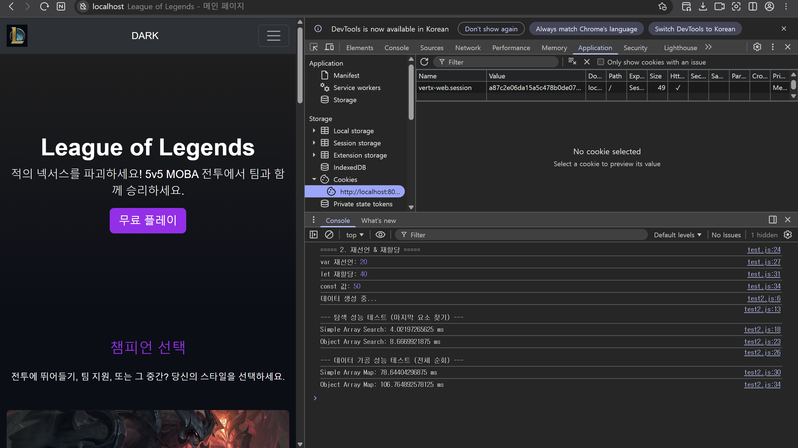
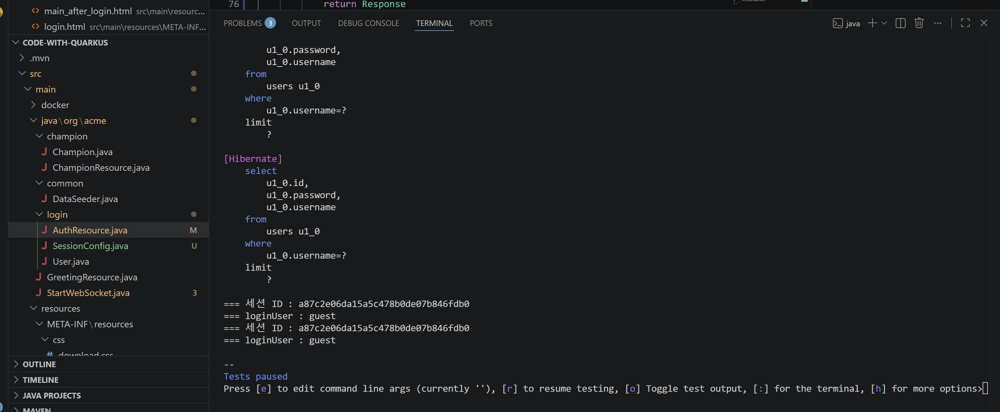
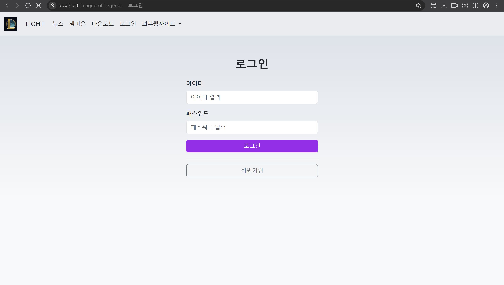
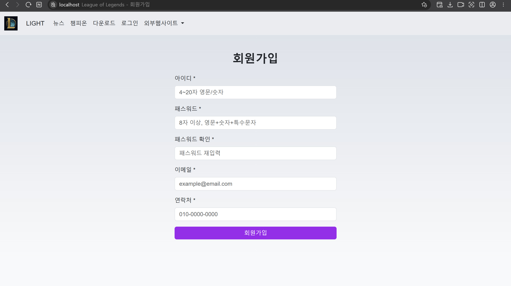
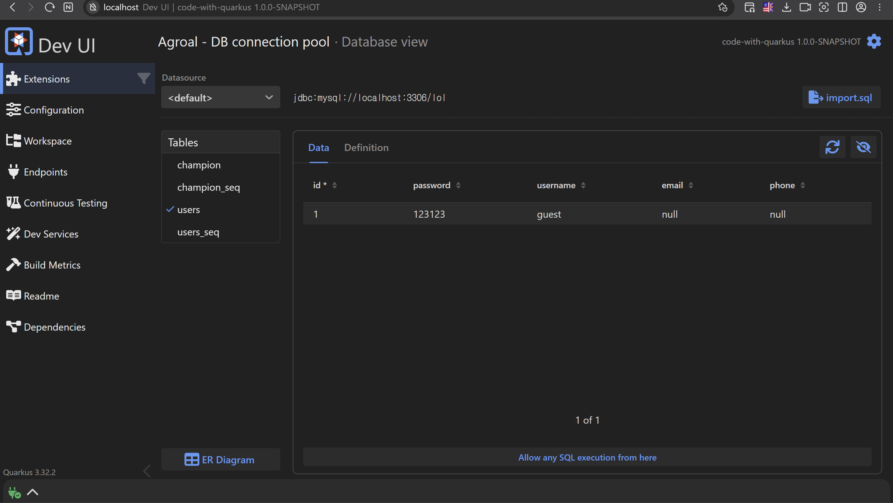
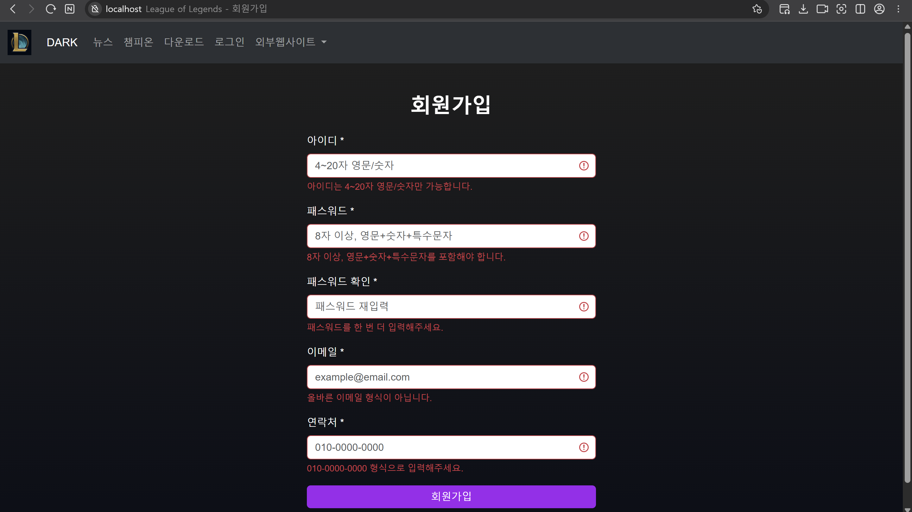
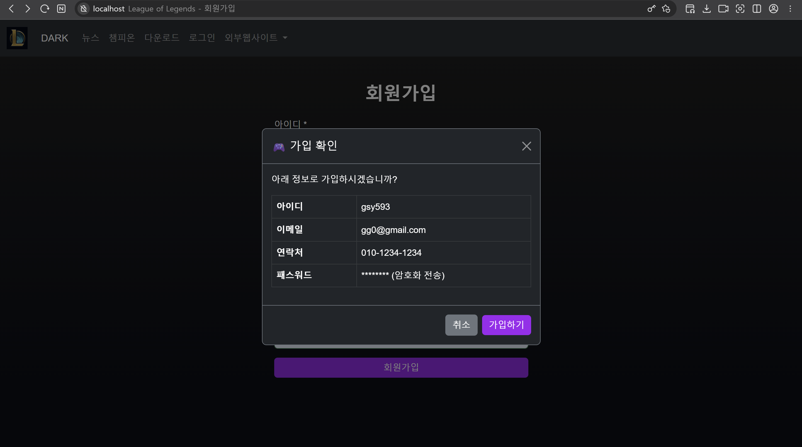
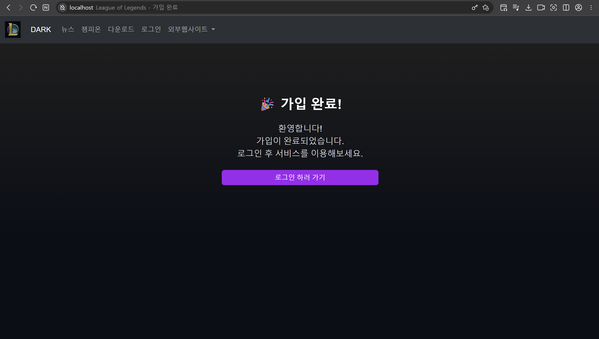
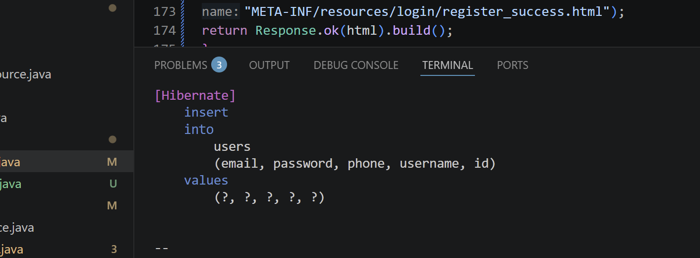
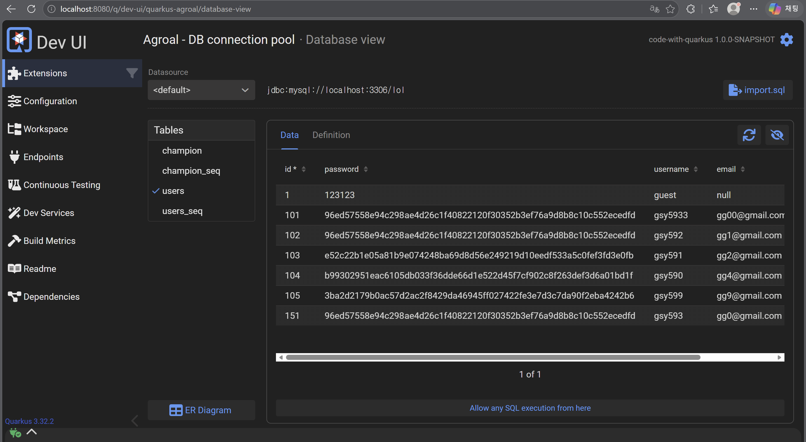
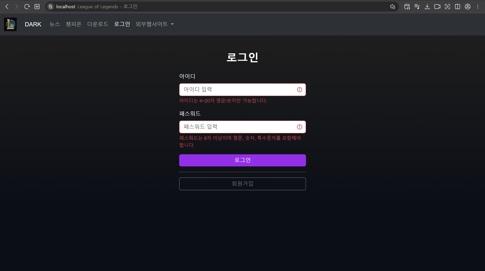
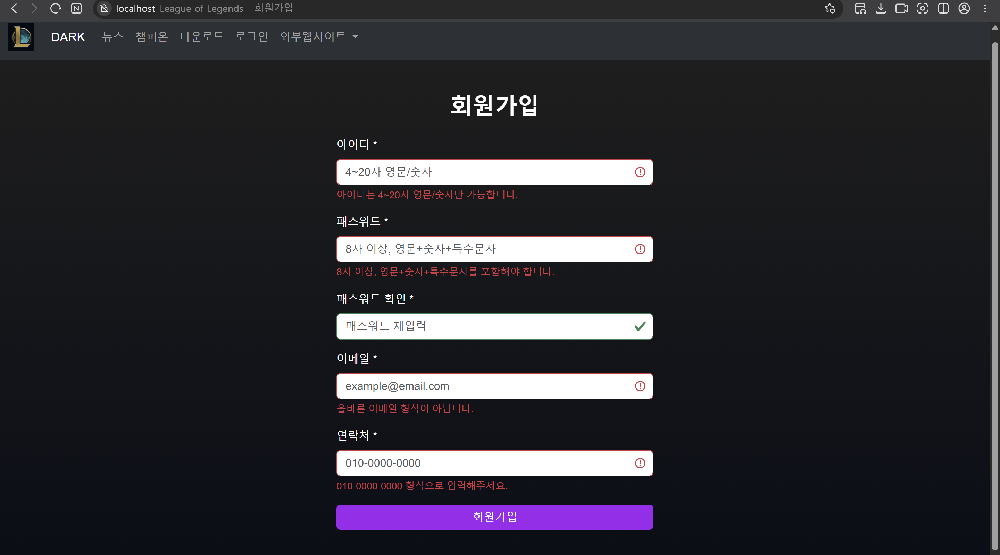

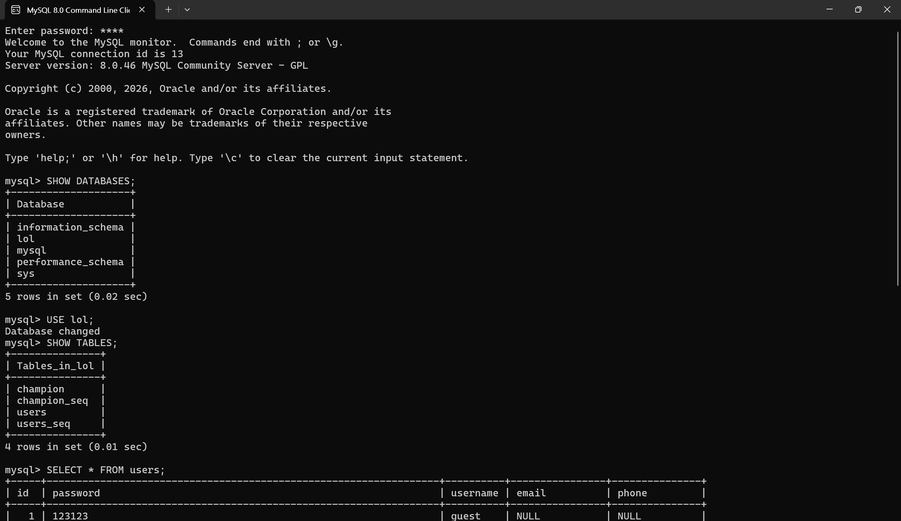
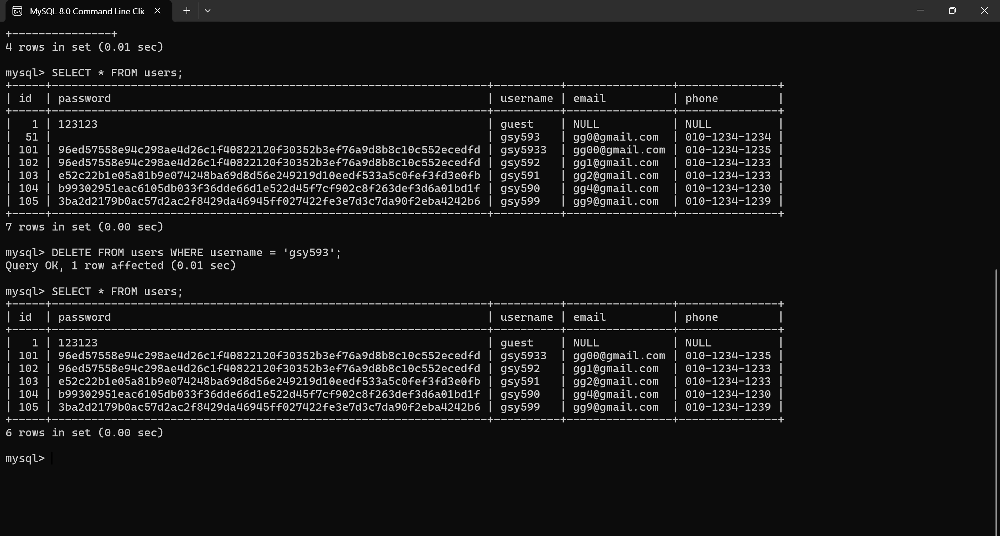

 